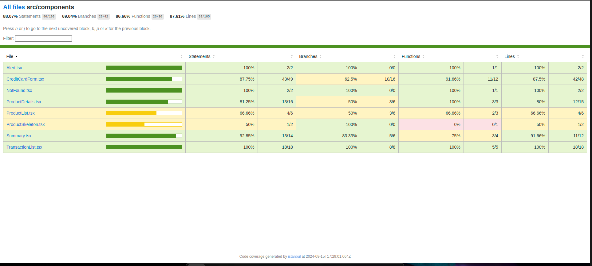

# FullStack Test - Fronted

# Descripción

Esta es la aplicación frontend para el proceso de pago de productos utilizando un proveedor externo. La aplicación permite a los usuarios:

1. Ver un producto disponible en la tienda con su descripción, precio y unidades disponibles en stock.
2. Iniciar el proceso de pago con tarjeta de crédito.
3. Ingresar la información de la tarjeta de crédito y los datos de entrega.
4. Ver un resumen del pago, incluyendo el producto, cantidad y total a pagar.
5. Procesar el pago y mostrar el resultado de la transacción.
6. Actualizar el stock del producto después de una transacción exitosa.

La aplicación está diseñada con un enfoque móvil y es responsiva para adaptarse a diferentes tamaños de pantalla, centrando la experiencia en dispositivos móviles.

Tabla de Contenidos
=================

- [FullStack Test - Fronted](#fullstack-test---fronted)
- [Descripción](#descripción)
- [Tabla de Contenidos](#tabla-de-contenidos)
- [Tecnologías Utilizadas](#tecnologías-utilizadas)
- [Estado de Cobertura de Pruebas](#estado-de-cobertura-de-pruebas)
- [Requerimientos](#requerimientos)
- [Instalación](#instalación)
- [Ejecución](#ejecución)


URL de la aplicación: [https://product-pad-web.zeabur.app/](https://product-pad-web.zeabur.app/)


# Tecnologías Utilizadas

- React
- Redux Toolkit
- TypeScript
- React Router Dom
- CSS Modules
- Vitest
- React Testing Library
- Axios

# Estado de Cobertura de Pruebas



Nota: La imagen anterior muestra el estado actual de la cobertura de pruebas unitarias, superando el 80% requerido.

# Requerimientos

- Node.js
- npm
- Git
- API Backend ([Ver Repositorio](https://github.com/yarango582/product-paid-api))

# Instalación

1. Clonar el repositorio

```bash
git clone
```

2. Instalar las dependencias

```bash
npm install
```

# Ejecución

1. Iniciar la aplicación

```bash
npm run dev
```

2. Abrir el navegador en la dirección [http://localhost:5173](http://localhost:5173)


